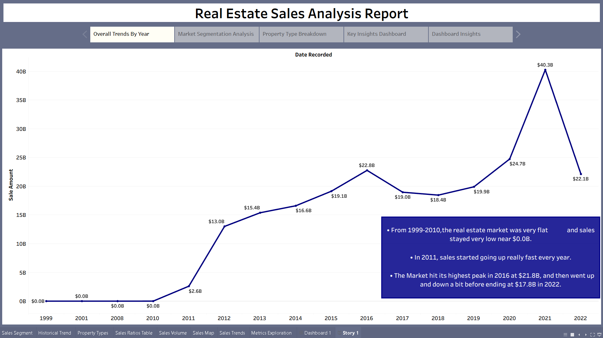
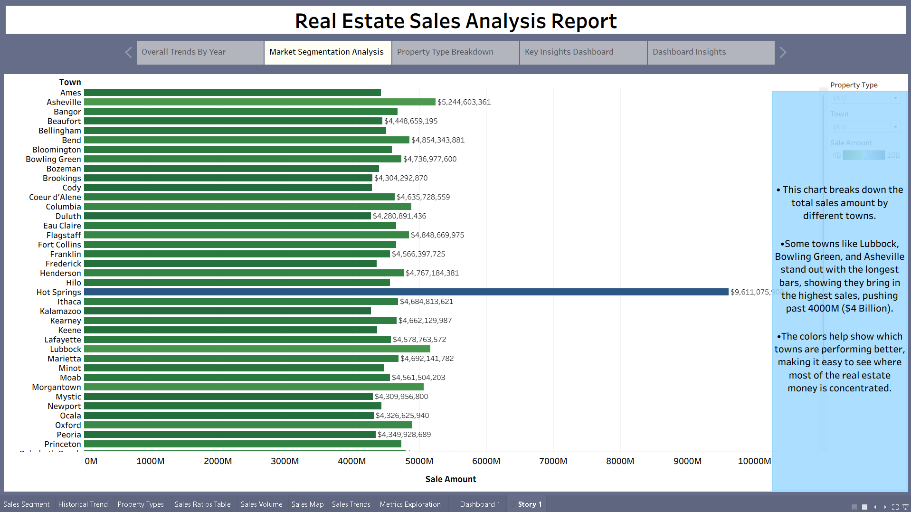
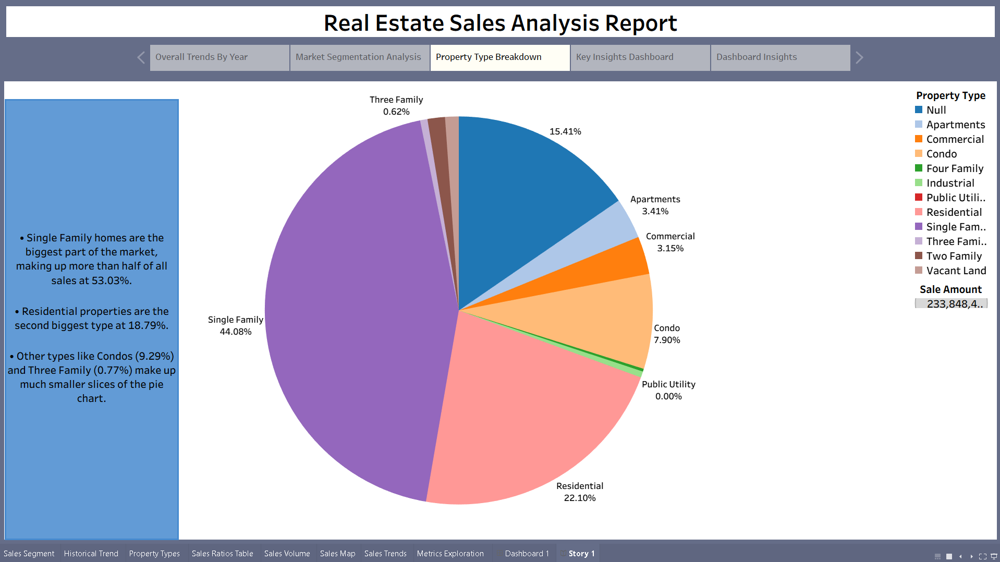
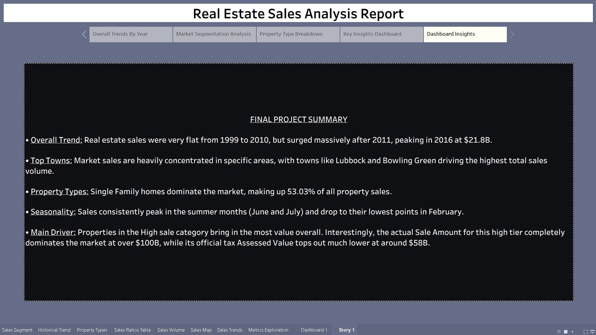
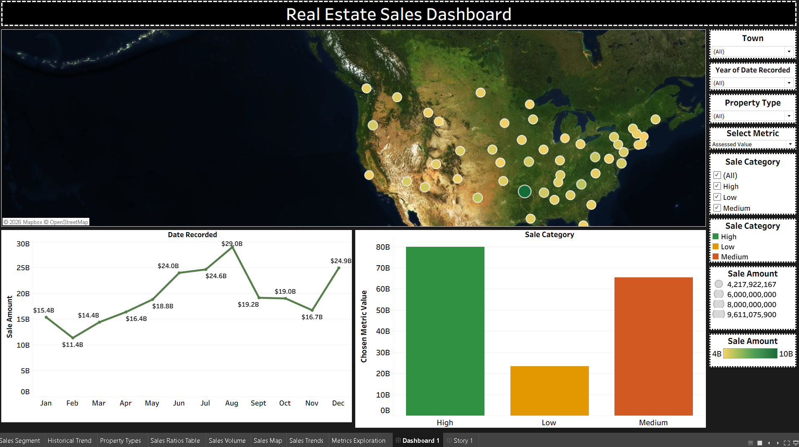

# Real-Estate-Sales-Tableau-Analysis
Tableau analysis of real estate sales trends, market segmentation, property types, sales ratios, and geographic performance.

## 📌 Overview

This project uses Tableau to analyze real estate sales data from 2011 to 2022. The analysis explores yearly sales trends, property types, market segments, sales ratios, assessed values, sale amounts, and geographic patterns. An interactive Story combines multiple visualizations to present the key findings.

## 📊 Dashboard & Story Preview

### Overall Trends By Year

### Market Segmentation Analysis

### Property Type Breakdown

### Key Insights Dashboard

### Dashboard Insights

## 📂 Repository Files

* `real_estate_sales_tableau.twbx` — Packaged Tableau workbook containing worksheets, dashboard, calculations, and Story.
* `real_estate_sales.csv` — Source dataset used for the analysis.
* `01_overall_trends_by_year.png` — Story point showing yearly sales trends.
* `02_market_segmentation_analysis.png` — Story point analyzing market segments.
* `03_property_type_breakdown.png` — Story point analyzing property types.
* `04_key_insights_dashboard.png` — Key insights dashboard.
* `05_dashboard_insights.png` — Final Story insights view.
* `README.md` — Project documentation and key findings.

## 🛠️ Key Techniques

* Data preparation and field analysis
* Calculated fields and parameters
* Time-series analysis
* Geographic analysis using maps
* Property type segmentation
* Sales amount and assessed value analysis
* Sales ratio analysis
* Market segmentation
* Interactive filters and visual exploration
* Dashboard design and Storytelling
* KPI and comparative analysis

## 🔍 Key Insights

* Analyzed changes in real estate sales activity across years.
* Compared sales performance across different property types.
* Examined market segments based on sales characteristics.
* Compared assessed values with actual sale amounts using sales ratios.
* Analyzed geographic differences in real estate sales.
* Used interactive Story points to bring together trends, segmentation, property analysis, and key findings.

## 💡 Recommendations

* Monitor yearly sales trends to identify changes in market activity.
* Compare property types regularly to understand shifts in buyer demand.
* Use sales ratios and assessed values to identify differences between assessed and actual market values.
* Analyze geographic performance to identify stronger and weaker markets.
* Use interactive Tableau dashboards to support ongoing real estate market monitoring and decision-making.
